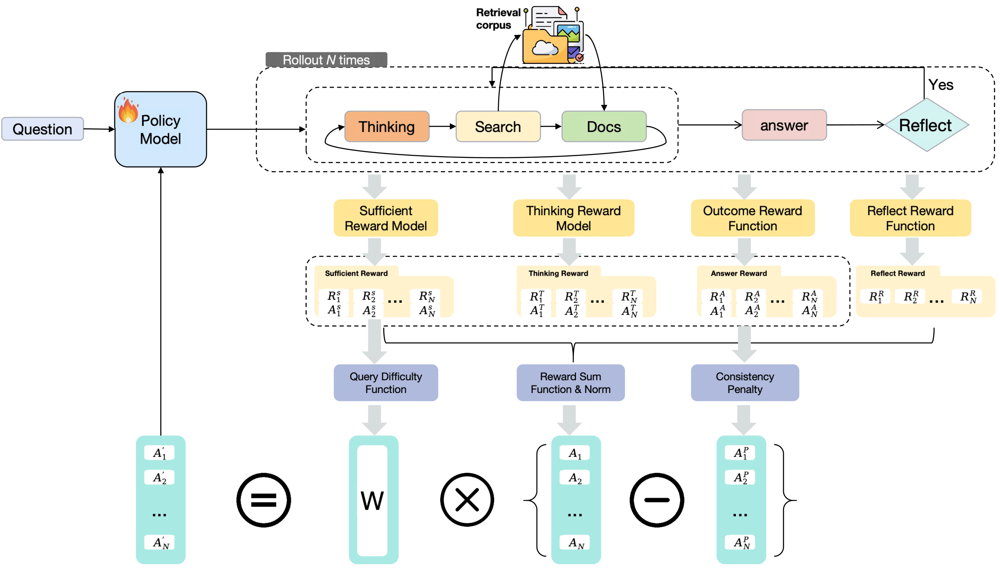

# From Sufficiency to Reflection: Reinforcement‑Guided Thinking Quality in Retrieval‑Augmented Reasoning for LLMs

## 📖 Overview

This project introduces TIRESRAG‑R1, which introduces a 🧠 think–retrieve–reflect process and 🎯 multi-dimensional reward design to improve reasoning quality in Retrieval-Augmented Generation (RAG) for Large Language Models (LLMs). It outperforms prior RAG-RL approaches on multiple multi-hop QA benchmarks.





## 📊 Main Results

TIRESRAG‑R1 achieves strong performance gains over prior baselines on four multi-hop QA datasets:

| Method                 | HotpotQA EM | 2Wiki EM | Musique EM | Bamboogle EM |
|------------------------|-------------|----------|-------------|---------------|
| Direct Generation        | 18.0     | 19.0    | 3.6     | 20.8      |
| COT                      | 18.2     | 21.0    | 4.4     | 21.6      |
| Naive RAG                | 29.4     | 26.0    | 5.2     | 18.4      |
| Sure                     | 20.2     | 21.0    | 3.0     | 10.4      |
| IRCOT                    | 22.2     | 17.4    | 5.2     | 13.6      |
| Self-ask                 | 14.4     | 14.8    | 4.0     | 9.6       |
| RAG w/ Agentic Search    | 7.0      | 10.4    | 1.4     | 9.6       |
| Search-o1                | 12.4     | 17.0    | 3.4     | 14.4      |
| SFT                      | 15.8     | 28.4    | 2.2     | 8.0       |
| SimpleDeepSearcher       | 34.4     | 39.6    | 12.4    | 33.6      |
| ReSearch-Base            | 28.8     | 37.2    | 14.4    | 34.8      |
| ReSearch-Instruct        | 30.8     | 38.0    | 14.2    | 34.8      |
| R1-search-Base           | 30.8     | 37.2    | 13.6    | 33.2      |
| R1-search-Instruct       | 31.2     | 42.6    | 15.4    | 33.2      |
| Search-R1-Base           | 35.4     | 44.0    | 14.8    | 38.4      |
| Search-R1-Instruct       | 37.4     | 47.6    | 16.2    | 40.2      |
| LeTS-Instruct*           | 37.1     | 41.0    | 17.5    | 38.4      |
| **TIRESRAG-R1-Base**     | **41.0** | 52.4    | 16.2    | 40.4      |
| **TIRESRAG-R1-Instruct** | **41.0** | **52.8**| **19.4**| **44.0**   |


## 🚀 Quick Start

```bash
conda create -n TIRESRAG-R1 python=3.10
conda activate TIRESRAG-R1

pip install -r requirements.txt
```


## ⚙️ Retrieval Corpus

To download the retrieval corpus, please refer to the official KILT benchmark repository:

🔗 https://github.com/facebookresearch/KILT


## 🏗️ Retrieval Index Building

```bash
cd evaluation/FlashRAG/scripts/

# Step 1: Chunk the documents
bash chunk.sh

# Step 2: Build FAISS index
bash build_index.sh
```


## 🌐 Retrieval API Service

```bash
cd scripts
bash wiki_servish.sh
```


## 🏆 Reward API Services

```bash
cd scripts

# Start answer reflection reward service
bash answer_reflection_reward.sh

# Start sufficiency and thinking reward service
bash sufficient_thinking_reward.sh
```


## 🧪 Model Training

```bash
cd scripts
bash qwen_grpo.sh
```


## 📁 Project Structure

```
.
├── evaluation/
│   └── FlashRAG/scripts/
│       ├── chunk.sh
│       └── build_index.sh
├── scripts/
│   ├── wiki_servish.sh
│   ├── answer_reflection_reward.sh
│   ├── sufficient_thinking_reward.sh
│   └── qwen_grpo.sh
├── requirements.txt
├── figure1_performance.png
└── README.md
```

---

## 📖 Citation

If you use TIRESRAG‑R1 in your research, please cite:

```bibtex
@article{tiresrag2025,
  title={From Sufficiency to Reflection: Reinforcement-Guided Thinking Quality in Retrieval-Augmented Reasoning for LLMs},
  author={Jie, He and Víctor Gutiérrez-Basulto and Jeff Z. Pan},
  journal={arxiv preprint},
  year={2025}
}
```

## 🙏 Acknowledgments

We would like to thank the following open-source projects and their authors for providing the foundation of this work:

- [FlashRAG](https://github.com/RUC-NLPIR/FlashRAG) for the retrieval framework
- [OpenRLHF](https://github.com/OpenRLHF/OpenRLHF) for the reinforcement learning framework
- [R1-Searcher](https://github.com/RUCAIBox/R1-Searcher) for the RAG-R1 training framework
